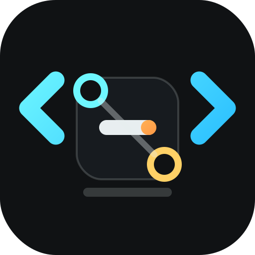
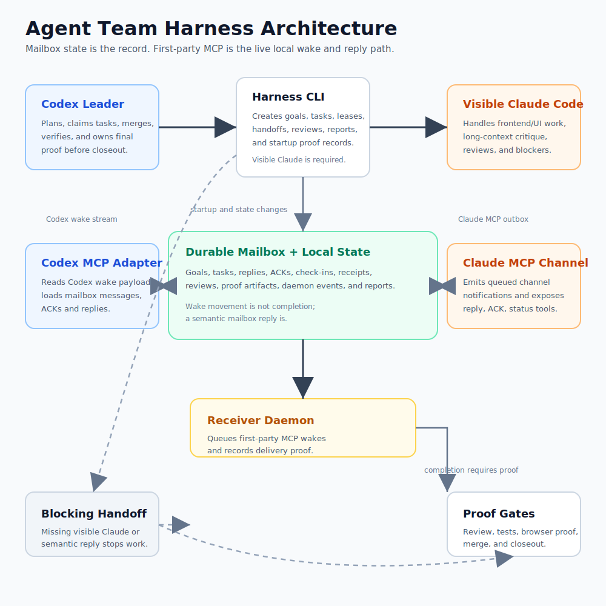

# Agent Team Harness



Alpha release: `0.1.0-alpha`

Created and maintained by Andrew Guzman.

Agent Team Harness is a local CLI for running Codex and Claude Code as coding teammates.

Codex owns the harness, task state, merge gates, and proof. Claude Code is the visible teammate for frontend/UI/UX work, long-context critique, and cross-model review. Communication is mailbox-first, so Codex can keep working while Claude is busy.



Landing page: [`site/index.html`](site/index.html), deployable through GitHub Pages.

## What It Does

- Starts or reuses a visible Claude Code teammate for the current project.
- Stores goals, tasks, leases, reviews, proof, mailbox messages, and closeout records locally.
- Routes frontend work to Claude and backend/proof work to Codex.
- Uses a durable mailbox as the source of truth for teammate communication.
- Supports nonblocking review requests, semantic acknowledgements, check-ins, and batch replies.
- Requires proof before tasks can be marked done.
- Generates closeout reports and optional self-heal/refactor recommendations.

## Requirements

- Node.js `>=22.13.0`
- Codex
- Claude Code, for live Claude teammate sessions
- `npm`, used by the installer to fetch the pinned Claude channel bridge

## Install For Codex

```bash
git clone https://github.com/andrewnova/agent-team-harness.git
cd agent-team-harness
./scripts/install-codex.sh
```

The installer:

- validates Node.js,
- installs an `agent-team` wrapper into `~/.local/bin`,
- installs the Codex skill into `${CODEX_HOME:-~/.codex}/skills/agent-team-harness`,
- installs pinned `claude-channel-cli@0.3.0` into `~/.local/share/agent-team`,
- writes `claude-channel` and `claude-channel-server` wrappers into `~/.local/bin`,
- attempts user-scope Claude MCP registration so the bridge works from any project,
- validates the bundled plugin manifest,
- runs the Node test suite.

If Claude Code is not installed or authenticated yet, the bridge install still completes and reports the next repair command. After Claude is ready, run:

```bash
agent-team doctor --fix --target my-project
agent-team channel auth
agent-team channel doctor --fix --target my-project
```

Offline or minimal install:

```bash
./scripts/install-codex.sh --skip-channel
agent-team channel install
```

## Quickstart

From any project directory:

```bash
agent-team start --name my-project --project-dir "$PWD" --daemon
```

For offline or deterministic local testing:

```bash
agent-team start --name my-project --project-dir "$PWD" --no-ensure-claude
agent-team cockpit --no-live-channel
```

## Typical Flow

```bash
agent-team init
agent-team goal new --title "Build feature" --objective "Ship the feature with proof"
agent-team plan codex --goal G-000001 --text "Codex proposal"
agent-team plan claude --goal G-000001 --prompt "Review this plan"
agent-team plan import-claude --goal G-000001
agent-team plan reconcile --goal G-000001 --text "Final task split"
agent-team tasks create --json tasks.json
agent-team promote-dev
```

Then for each task:

```bash
agent-team claim T-000001 --owner codex --reason "backend/proof task"
agent-team attempt T-000001 --json attempt.json
agent-team review request T-000001
agent-team review import T-000001
agent-team merge T-000001
agent-team verify run T-000001
agent-team done T-000001
agent-team verify final
```

## Mailbox-First Communication

The mailbox is the durable communication truth. The managed Claude channel bridge is installed by the harness and is useful for startup, health checks, and explicit smoke tests, but normal development coordination should not depend on a synchronous reply window.

The receiver daemon is the bridge that makes Codex and Claude feel connected without blocking either model. It watches mailbox traffic, records receipt ACKs, surfaces semantic ACK/reply requirements, shows check-ins in cockpit, and lets Codex import Claude's answer when it arrives.

Do not delegate real Claude work through raw `ask_claude` or a direct live-channel wait. Planning, implementation, review, refactor, and debugging work should go through mailbox-backed harness commands such as `plan claude`, `review request`, `channel steer`, or `mailbox send --to claude --kind request --reply-required`. The raw live channel is for health checks, smoke tests, and low-level diagnostics only.

Claude can check in at any time:

```bash
agent-team mailbox send \
  --from claude \
  --to codex \
  --kind checkin \
  --task T-000001 \
  --subject "Still working" \
  --body "Waiting on frontend subagents; next milestone is mobile proof."
```

Codex can ask Claude for a nonblocking review:

```bash
agent-team review request T-000001
agent-team await reply --request-id req_... --once
agent-team review import T-000001 --request-id req_...
```

## Project Layout

```text
agent-team/                         CLI source and tests
plugins/agent-team-harness/         Codex plugin/skill wrapper
scripts/install-codex.sh            local Codex installer
assets/agent-team-flow.svg          README diagram
```

Generated runtime state is written to `.agent-team/` in the project being operated on. It should not be committed.

Managed bridge tools are installed outside the repo at `~/.local/share/agent-team/claude-channel-cli` by default. Set `AGENT_TEAM_TOOLS_DIR` or pass `--tools-dir` to change that location.

## Development

```bash
cd agent-team
npm test
```

The suite covers task lifecycle, review import, mailbox behavior, durable waiting, daemon receipts, browser/computer proof gates, worktrees, closeout reports, and plugin launch behavior.

## Safety Notes

- Do not commit credentials, browser profiles, Claude channel tokens, provider keys, or generated `.agent-team/` runtime state.
- Use the CLI for state changes; do not hand-edit task JSON or SQLite.
- Codex remains final proof owner even when Claude implements or reviews work.
