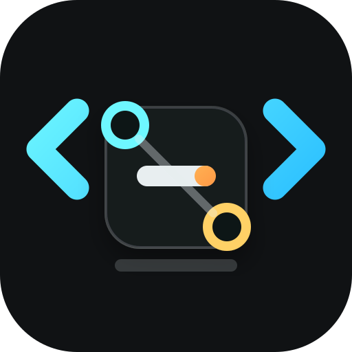
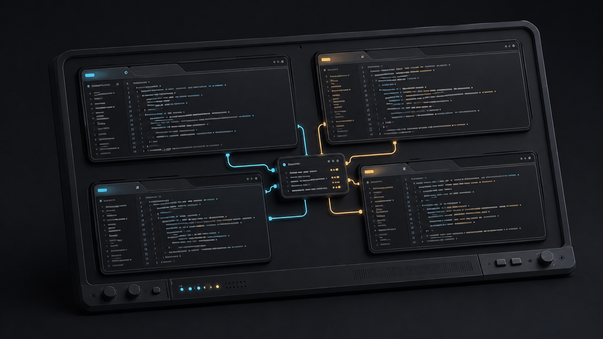

# Agent Team Harness



**Start with a direct native Codex or Claude Code session.**

For a bounded coding task or review, open your repository in the native CLI, give it the task, and check the result. Native child agents can handle useful independent work. The coordinated cmux workflow is experimental.

[Website](https://andrewnova.github.io/agent-team-harness/) · [Direct-session guide](docs/direct-sessions.md) · [Experimental teams](docs/cmux-team.md)

## Quickstart

Use your installed, signed-in CLI in the target repository:

```sh
cd /absolute/path/to/your/repo
codex --model gpt-6-astra -c 'model_reasoning_effort="xhigh"'
```

Or start Claude Code:

```sh
cd /absolute/path/to/your/repo
claude --model 'claude-fable-5-1[1m]' --effort medium \
  --settings '{"switchModelsOnFlag":false}'
```

Choose explicit model IDs available to your account. These examples use the existing Astra / xhigh and Fable / medium preferences. Native authentication, trust, and permission settings remain in force. No harness installation, cmux, coordinator, or global configuration change is required for this path.

Give the session a concrete task:

> Add a settings page with saved notification preferences. Inspect the existing app, make the change, and verify saving and reloading. Use independent child agents where useful. Report the changed files, checks, and remaining issues.

Keep one writer per checkout. For parallel writing, use separate worktrees. Once the candidate is committed, use a fresh session for an independent review of that exact commit and its requirements. [Implementation and review prompts](docs/direct-sessions.md).

## Invoke the team skill

For a reusable task prompt in either app, run this from a local clone of this repository:

```sh
./scripts/install-team-skill.sh
```

Keep the clone available: the installer links one shared skill into both apps. It preserves any existing different `team` skill and installs no daemon or MCP configuration.

| App | Invocation |
| --- | --- |
| Claude Code | `/team Add a settings page and verify saving preferences` |
| Codex desktop | Type `@team`, select the skill suggestion, then enter your task |
| Codex CLI | `$team Add a settings page and verify saving preferences` |

The current session leads, uses native agents for useful independent work, and gets a fresh read-only review. Start a new session if the skill is not visible. The [team skill](plugins/agent-team-harness/skills/team/SKILL.md) keeps cmux coordination optional. See [Codex skill invocation](https://learn.chatgpt.com/docs/build-skills#how-codex-uses-skills) and [Claude skill naming](https://code.claude.com/docs/en/skills#how-a-skill-gets-its-command-name).

## Why this is the default

In the September 6 trial, neither coordinated small-task run reached feature acceptance during a twenty-minute observation window. Native prompts required repeated operator handling. Startup, addressed communication, and individual worker completion worked, but that did not establish a useful complete workflow.

The trial preceded the final lifecycle repairs. Passing their deterministic tests does not prove a speed advantage for the repaired team workflow. Direct sessions are the default for bounded work; coordination must earn its extra steps on a genuinely parallel workload. [Trial findings](docs/native-workflow-findings.md).

## Experimental teams in cmux

The optional harness groups native lead, worker, and reviewer sessions in one cmux workspace. It owns concurrent-writer claims, addressed messages, feature assembly, and review/check evidence. cmux owns visible tabs; the native CLIs own model execution, child agents, authentication, and approvals. There is no harness scheduler.



*Conceptual artwork generated with GPT Image 2. Alpha software, maintained by Andrew Guzman.*

For an explicit team experiment, use macOS, cmux, Git, Node.js 22.13 or later, and both native CLIs. From a terminal inside cmux:

```sh
git clone https://github.com/andrewnova/agent-team-harness.git
cd agent-team-harness
node scripts/start-team.js --project /absolute/path/to/your/repo
```

The starter creates local coordinator state outside the target Git checkout and opens an Astra lead. Complete native prompts, wait for its readiness report, then give it a task. Use `--leader claude` for a Fable lead. Up to four jobs, including the lead, can be active by default; native child agents are governed by their CLI and account limits.

Running the same command again inspects the existing active lead. It does not prove that blocked or incomplete work has recovered. `node scripts/start-team.js --help` lists capacity and executable/model overrides.

[Team startup, ownership, messaging, review, and recovery](docs/cmux-team.md). Existing users of `start --daemon` can use the [legacy guide](docs/legacy-workflow.md). Neither path is required for ordinary direct-session work.

## Development

```sh
npm --prefix agent-team ci
npm --prefix agent-team run lint
npm --prefix agent-team test
```

The website is static HTML, CSS, and JavaScript under `site/`. GitHub Actions deploys it to GitHub Pages when `main` changes. [Image provenance](docs/website-image.md).
